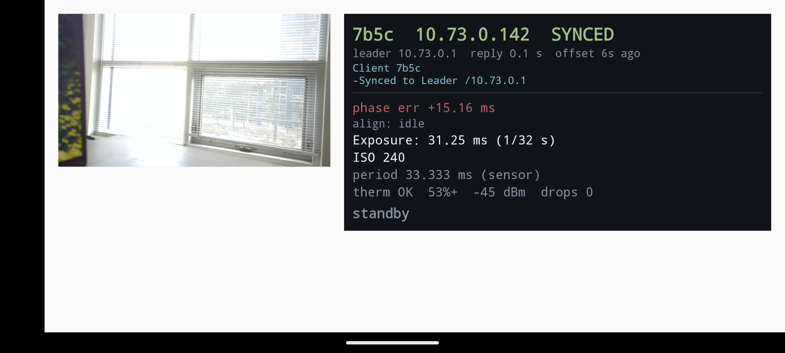
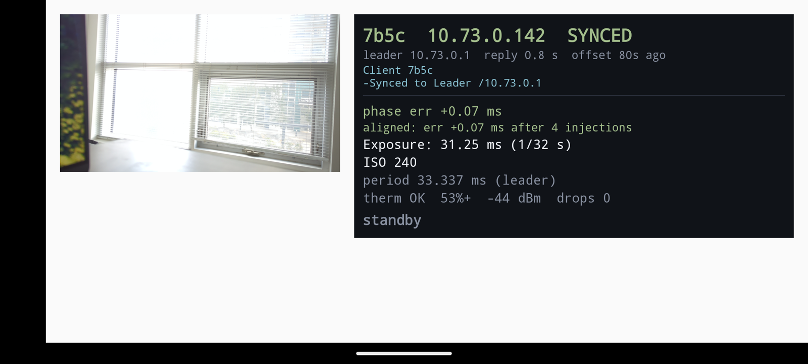
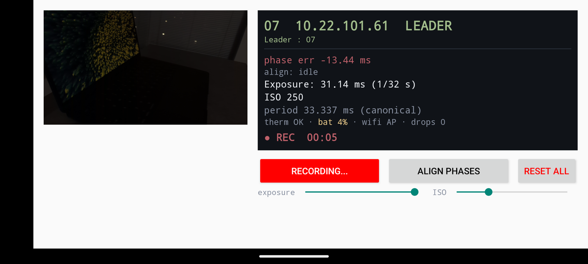

# RigSync kit

Operator guide and post-processing tools for **RigSync**, the synchronized
multi-phone video capture app running on an 11 × Pixel 7 rig. The app is
installed on the rig's phones and is not distributed here. This repository is
what a user of the rig needs: how to record a synchronized take, and how to
turn the per-phone files into frame-aligned image sequences.

**Roles.** Phone 1 hosts the Wi-Fi hotspot and is therefore the **leader**,
the only phone with controls. Phones 2 to 11 join its hotspot as **clients**.
The hotspot name and password are on the label on Phone 1's case, deliberately
not in this public guide.

## Field guide

| step | on | do | expect on screen | wait |
|---|---|---|---|---|
| 1 | Phone 1 | turn the Wi-Fi hotspot on, **then** open RigSync | header `01 <ip> LEADER`, status `wifi AP`, three buttons and two sliders (Figure 1) | about 15 s |
| 2 | Phones 2 to 11 | join Phone 1's hotspot, then open RigSync | header `SYNCED`, line `leader <ip> reply … offset … ago`; clients have no buttons (Figure 2) | about 10 s each |
| 3 | Phone 1 | drag the **exposure** and **ISO** sliders | previews neither too bright nor too dark on every phone; a value is sent to all phones when you release the slider | |
| 4 | Phone 1 | tap **ALIGN PHASES** | `phase err` on every phone goes from red (tens of ms) to green (about 0.1 ms or less), with `aligned: err … after N injections` (Figure 3) | about 10 s |
| 5 | Phone 1 | tap **RECORD VIDEO**; tap it again to stop | button turns red `RECORDING…`, status `● REC mm:ss` (Figure 4); clients show a toast `Started recording video` | the take |
| 6 | Phone 1 | tap **RESET ALL** once it no longer reads `Waiting` | every phone restarts the app and comes back `SYNCED`; then redo steps 3 and 4 before the next take | about 15 s |

`phase err` is how far this phone's frame timing sits from the leader's;
`injections` are the small frame-timing nudges the app uses to close it.


**Figure 1.** The leader in standby, here Phone 07 during a bench test: header
`LEADER`, status `wifi AP`, the three controls and the exposure and ISO
sliders. `phase err −13.33 ms` in red is the state before alignment.



**Figure 2.** A client just after joining: `SYNCED` to the leader,
`phase err +15.16 ms` in red because phases are not aligned yet, no buttons.



**Figure 3.** The same client after ALIGN PHASES: `phase err +0.07 ms` in
green and `aligned: err +0.07 ms after 4 injections`.



**Figure 4.** The leader while recording: the button reads `RECORDING…` in
red and the status line shows `● REC 00:05`.

### Rules of a take

- Hands off every phone from a few seconds before start to a few seconds
  after stop. Touching a phone disturbs its timing, and the damage shows up
  only in post-processing.
- One take per reset: RESET ALL, then exposure, then ALIGN PHASES, then record.
- Before recording, read the status line on the leader: `therm OK`, a battery
  level you can finish the take on, `drops 0`.

### What can go wrong

| symptom | cause | fix |
|---|---|---|
| Phone 1 shows `SYNCED` or no buttons | the app was opened before the hotspot was up, so it did not detect itself as leader | close the app, confirm the hotspot is on, reopen |
| a client never shows `SYNCED` | not on Phone 1's hotspot | check its Wi-Fi, then reopen the app |
| `phase err` stays red on one phone after ALIGN PHASES | that phone missed the alignment | tap ALIGN PHASES again; if it persists, RESET ALL |
| `drops` counting up on the leader | Wi-Fi congestion | move Phone 1 to the middle of the rig, away from other radios |
| RESET ALL reads `Waiting` | the button is gated for a few seconds after the app starts | wait for it to read `RESET ALL` |

## Getting the files off the phones

Each phone saves one video and one timestamp file per take in its shared
storage (the folder name `RecSync` is inherited from the upstream app):

```
RecSync/VID/VID_20260826_020850.mp4
RecSync/20260826_020850.csv
```

Copy them by USB or with `adb pull /sdcard/RecSync/`, and arrange them by
phone number, one take per session folder:

```
<session>/raw/01/VID/VID_20260826_020850.mp4
<session>/raw/01/20260826_020850.csv
<session>/raw/02/VID/VID_20260826_020849.mp4
<session>/raw/02/20260826_020849.csv
…
```

The stamps differ by a second or two across phones because each phone names
files by its own clock; pair takes by order. Details in
[docs/FORMAT.md](docs/FORMAT.md).

## Post-processing: frame-aligned image sequences

Needs Python 3.10 or newer (tested on 3.11) and `ffmpeg` / `ffprobe` on the PATH.

```bash
python3 -m venv .venv && .venv/bin/pip install -r requirements.txt
.venv/bin/python tools/run_sync_pipeline.py <session>/raw --threshold 16ms
```

The command runs five stages and modifies nothing on disk if the first check
fails:

1. **Discover cameras**: one video per `NN/VID/`.
2. **Metadata gate**: video frame count (ffprobe) against CSV line count for
   every camera; on any mismatch it prints the table and stops.
3. **Timestamp match**: `<session>/output/<session>_16ms/matched.csv`, one
   row per synchronized moment, one column per camera.
4. **Extract and rename**: every frame to `raw/NN/images/<timestamp>.jpg`.
5. **Move unmatched**: frames without a partner on some camera go to
   `raw/NN/images/unmatched/`.

Afterwards each camera's `images/` holds only the synchronized sequence, and a
row of `matched.csv` names one image per camera. 16 ms is just under half of
the 33.3 ms frame period at 30 fps, so a frame either has one partner per
camera or none.

| flag | default | meaning |
|---|---|---|
| `--threshold` | `16ms` | match tolerance (`ns`, `us`, `ms`, `s`) |
| `--output-root` | `<session>/output` | where `<slug>_<threshold>/` goes |
| `--session-slug` | folder above `raw` | label of the output folder |
| `--match-mode` | `full` | `full`, or `first` to align by first matched frame and cut all cameras to equal length |
| `--cpu` | off | force CPU decoding |
| `--force-extract` | off | re-extract even if `images/` exists |
| `--dry-run` | off | print the plan, write nothing |

If the gate stops, a take was cut short on that phone. Reconcile explicitly:

```bash
.venv/bin/python tools/analyze_vid.py <session>/raw --truncate   # drop excess CSV lines
.venv/bin/python tools/analyze_vid.py <session>/raw --pad_csv    # add marker lines the matcher ignores
```

The other two scripts are the stages as standalone commands: `tools/sync.py`
(match, optionally `--extract`) and `tools/move_unmatched.py` (move, or
`--move_back` to undo).

Tests: `.venv/bin/pip install pytest && .venv/bin/python -m pytest`. They build
tiny real videos with ffmpeg and run the whole pipeline on them.

## How well the rig is synchronized

The app's timing claim is checked optically, by filming an LED time-code
panel with every phone at once and reading the code frame by frame. The
measurements are published at
<https://yubohuangai.github.io/syncbench/>, for example the
[13-camera session of 2026-08-26](https://yubohuangai.github.io/syncbench/results/sync0826/frame_report_windows.html).

## License

MIT, see [LICENSE](LICENSE). The RigSync app is a fork of
[RecSync-android](https://github.com/MobileRoboticsSkoltech/RecSync-android)
(Akhmetyanov et al., 2021), which builds on Google Research's
[wireless software synchronization](https://arxiv.org/abs/1812.09366)
(Ansari et al., 2019). The app is not part of this repository.
