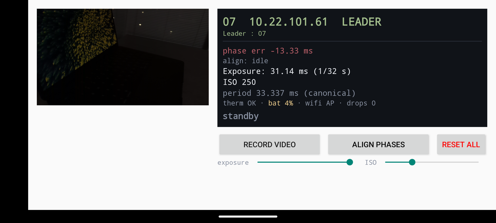

# RigSync kit

## Field guide

| step | on | do | expect on screen | wait |
|---|---|---|---|---|
| 1 | Phone 1 | turn the Wi-Fi hotspot on (password: label on Phone 1's case), **then** open RigSync | header `01 <ip> LEADER`, status `wifi AP`, three buttons and two sliders  | about 15 s |
| 2 | Phones 2 to 11 | join Phone 1's hotspot, then open RigSync | header `SYNCED`, line `leader <ip> reply … offset … ago`; clients have no buttons | about 10 s each |
| 3 | Phone 1 | drag the **exposure** and **ISO** sliders | previews neither too bright nor too dark on every phone; a value is sent to all phones when you release the slider | |
| 4 | Phone 1 | tap **ALIGN PHASES** | `phase err` on every phone goes from red (tens of ms) to green (about 0.1 ms or less), with `aligned: err … after N injections` | about 10 s |
| 5 | Phone 1 | tap **RECORD VIDEO**; tap it again to stop | button turns red `RECORDING…`, status `● REC mm:ss`; clients show a toast `Started recording video` | the take |
| 6 | Phone 1 | tap **RESET ALL** once it no longer reads `Waiting` | every phone restarts the app and comes back `SYNCED`; then redo steps 3 and 4 before the next take | about 15 s |



**The leader in standby** (here Phone 07 on the bench): header `LEADER`,
status `wifi AP`, the three controls and the two sliders. `phase err` is how
far this phone's frame timing sits from the leader's, red before alignment and
green (about 0.1 ms) after step 4.

## Getting the files off the phones

Each phone saves one video and one timestamp file per take in its shared
storage (the folder name `RecSync` is inherited from the upstream app):

```
RecSync/VID/VID_20260826_020850.mp4
RecSync/20260826_020850.csv
```

Copy them by USB or with `adb pull /sdcard/RecSync/`, and arrange them by
phone number, one take per session folder:

```
<session>/raw/01/VID/VID_20260826_020850.mp4
<session>/raw/01/20260826_020850.csv
<session>/raw/02/VID/VID_20260826_020849.mp4
<session>/raw/02/20260826_020849.csv
…
```

The stamps differ by a second or two across phones because each phone names
files by its own clock; pair takes by order. Details in
[docs/FORMAT.md](docs/FORMAT.md).

Then the tools here turn those files into frame-aligned image sequences
(Python 3.10+, with `ffmpeg` and `ffprobe` on the PATH):

```bash
python3 -m venv .venv && .venv/bin/pip install -r requirements.txt
.venv/bin/python tools/run_sync_pipeline.py <session>/raw --threshold 16ms
```

Each camera's `images/` then holds only the synchronized frames, and a row of
`<session>/output/<session>_16ms/matched.csv` names one image per camera. Run
`--help` on any tool for its flags.

## License

MIT, see [LICENSE](LICENSE). The app itself is not part of this repository;
it is a fork of [RecSync-android](https://github.com/MobileRoboticsSkoltech/RecSync-android).
